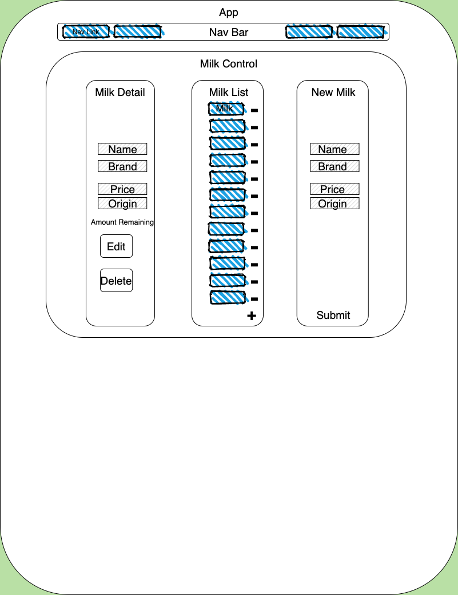

<h1 align="center">
  <br>
	

  <br>
MilkBar  <br>
</h1>

<h4 align="center">A minimal but beautiful tracker for a bar where they sell milk, using react with redux</h4>

<p align="center">
  <a href="#key-features">Key Features</a> •
  <a href="#how-to-use">How To Use</a> •
  <a href="#reach-out"> Reach Out </a> •
  <a href="#credits">Credits</a> •
  <a href="#you-may-also-like">Related</a> •
  <a href="#license">License</a>
</p>

## Key Features

- Tracks types of milk (price, brand, origin, amount remaining in keg)
- Easy to use Navigation Bar
- Add new Milk variety
- See all Milk varieties
- Delete Milk variety
- Sell 1 pint of milk
- Mobile Responsive Site
- Navigation Bar (Coming Soon!)

- Cross platform
  - Windows, macOS and Linux ready.

## Wireframe Mockup



## How To Use

To clone and run this application, you'll need [Git](https://git-scm.com), [NPM](https://www.npmjs.com/get-npm) installed. If you wish to review the raw code, it's easiest to download a code editor such as Visual Studio Code or Atom.

### Clone this repository from your Command Line:

`$ git clone https://github.com/MarielHamson/MilkBar.git`

### Go into the repository

`$ cd milkbar`

### Open repository in VS Code or other

`$ code .`

### Install dependencies in Root Project Directory (milkbar)

`$ npm install`
`$ npm install redux@4.0.5 react-redux@7.1.3`

### Run the app

`$ npm start`

## Reach Out

MilkBar is an [emailware](https://en.wiktionary.org/wiki/emailware). Meaning, if you liked using this app or it has helped you in any way, I'd like you send me an email at <mariel.hamson@gmail.com> about anything you'd want to say about this software. I'd really appreciate it!

## Credits

This software uses the following technologies:

- React (JSX)
- Redux
- CSS (Bootstrap for React)

## Support

<a href="https://www.buymeacoffee.com/" target="_blank"></a>

<p>Or</p>

<a href="https://www.patreon.com/">
	
</a>

## You may also like...

-- Other projects in my GitHub Repository

## License

MIT

---

> LinkedIn[MarielHamson](https://www.linkedin.com/MarielHamson) &nbsp;&middot;&nbsp;
> GitHub [MarielHamson](https://github.com/MarielHamson) &nbsp;&middot;&nbsp;
> Instagram [Miriquitecontrary](https://instagram.com/miriquitecontrary)

```

```
